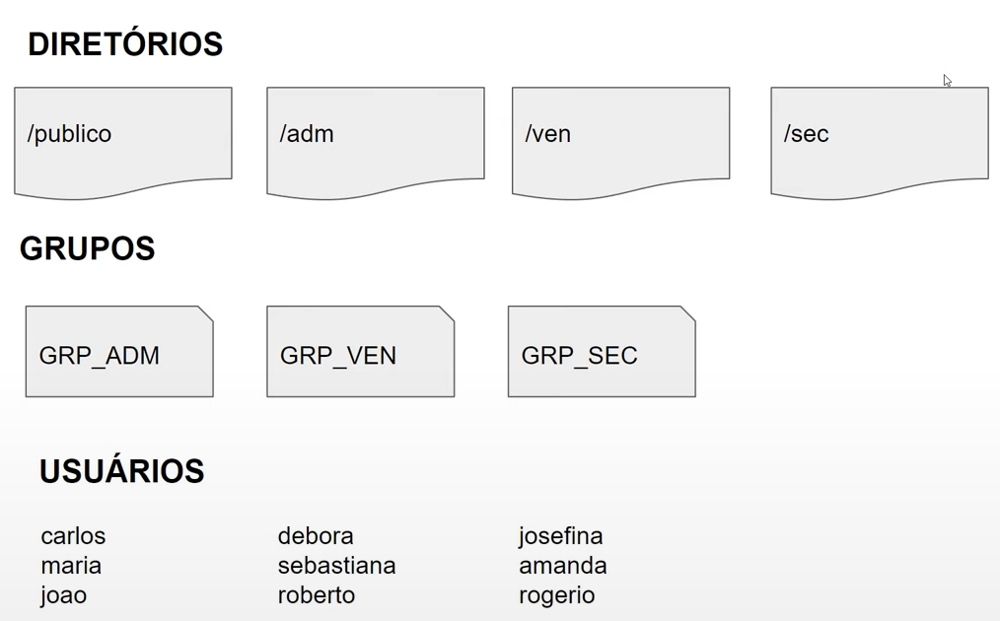

# Bootcamp Linux DIO 2023

## Projeto - Infraestrutura como código (IaC)

### Especificações

Para este projeto, será criado um script de definição de um setup básico com:
- usuários,
- diretórios, e
- permissões

### Definições

- Excluir diretórios, arquivos, grupos e usuários preexistentes
- Provisionamento feito em Bash Script
- O dono de todos os diretórios será o usuário raíz (root)
- Demais grupos de usuários:
  - com permissão total dentro dos respectivos diretórios
  - sem permissão de leitura, escria e execução nos diretórios de departamentos a que não pertençam

--- 
## Comandos simples
- `clear` limpa a tela (Atalho: Left Ctrl + L)
- `date` exibe a data
- `pwd` mostra o caminho atual
- `cd [novo-diretorio]` mudar de diretório (Change Directory)
  - `cd /` mudar o diretório para a raíz do disco 
- `ls` lista arquivos e diretórios no caminho atual
  - `ls -l` lista arquivos e diretórios com detalhes de permissões, donos, tamanhos, etc.
- `ls [padrao]` filtra e lista apenas arquivos que atendam ao padrão indicado
- `find [padrao]` encontra arquivos e diretórios que atendam ao padrão indicado
- `mkdir [novo-diretorio]` cria um novo diretório como o nome especificado
- `cat [arquivo]` concatena o conteúdo do arquivo à saída, ie. exibe o conteúdo do arquivo
  - `cat /etc/passwd` exibe os usuários do sistema
- `userdel [user]` remove um usuário
  - `userdel -r [user]` remove o usuário e seu diretório
- `groupadd [grupo]` cria um novo grupo de usuários
- `useradd [user]` cria usuário
  - `useradd [user] -m` cria usuario com diretório inicial (home)
  - `useradd [user] -s [shell]` cria usuario indicando o shell usado
  - `useradd [user] -p [password]` cria usuario indicando o hash da senha já criptografada
  - `useradd [user] -p $(openssl passwd -crypt [password])` cria usuario indicando a senha a ser criptografada
  - `useradd [user] -G [grupo]` cria usuario definindo seu grupo
- `chown [dono]:[grupo] [arquivo]` define o dono e grupo de um arquivo
- `chmod [modo] [arquivo]` define permissões para um arquivo
  
   
